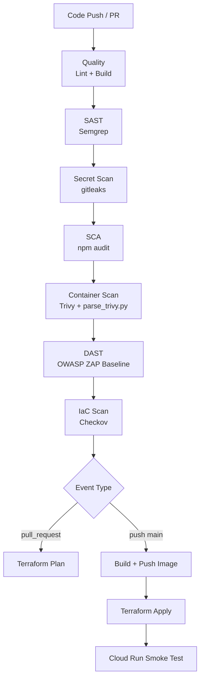

# DevSecOps Pipeline — ZenType on GCP

A full **Secure SDLC (S-SDLC)** security pipeline for a production Next.js application, deployed to Google Cloud Run via Terraform. Every code push runs through 9 automated security gates before anything goes live.

## 🌐 Live Application

| | URL |
|--|-----|
| **▶ Try the app** | https://devsecops-app-k5z6conxna-ew.a.run.app |
| **Firebase App Hosting** | https://zentype--zentype-65eb3.europe-west4.hosted.app |
| **CI/CD Pipeline** | https://github.com/jay-021/devsecops-terraform/actions |
| **GCP Cloud Run** | https://console.cloud.google.com/run?project=prismatic-rock-485510-c2 |

> The live URL is served from **GCP Cloud Run** (europe-west1) via this DevSecOps pipeline. Create an account, take a typing test, generate an AI test — all services are live and connected to the production Firebase project (`zentype-65eb3`).


## Architecture



## Pipeline Security Gates

| Job | Tool | JD Coverage | Fails On |
|-----|------|-------------|----------|
| SAST | Semgrep | SAST | HIGH severity code findings |
| Secret Scan | gitleaks | Secret scanning | Any secret detected |
| SCA | npm audit + Trivy | SCA + Container Scan | CRITICAL CVEs |
| DAST | OWASP ZAP | DAST | HIGH web vulnerabilities |
| IaC Scan | Checkov | IaC scanning | HIGH misconfigurations |
| Terraform Plan | Terraform | IaC, Cloud hygiene | Invalid plan |

## Infrastructure (Terraform)

- **Artifact Registry** — private Docker image storage
- **Cloud Run** — serverless container hosting, scales to zero
- **Service Accounts** — least-privilege: `cicd-sa` (deploy only), `run-sa` (runtime only)
- **Secret Manager** — runtime secrets never hardcoded
- **GCS backend** — remote Terraform state

## Getting Started

### One-time GCP Bootstrap
```bash
gcloud auth login
bash gcp-bootstrap.sh
```

### Local security checks
```bash
bash scripts/setup-devsecops.sh
```

### Terraform only
```bash
cd terraform/
terraform init
terraform plan -var="image_tag=local"
terraform apply -var="image_tag=local"
```

## GitHub Variables Required (OIDC, keyless)

| Variable | Required | Value |
|--------|----------|-------|
| `GCP_WIF_PROVIDER` | Yes | `projects/32349898958/locations/global/workloadIdentityPools/github-actions-pool/providers/github-provider` |
| `GCP_WIF_SERVICE_ACCOUNT` | Yes | `github-terraform-sa@prismatic-rock-485510-c2.iam.gserviceaccount.com` |

Notes:
- This repository now uses Workload Identity Federation (OIDC), so no long-lived JSON key is required.
- Set these as GitHub repository variables (`Settings -> Secrets and variables -> Actions -> Variables`).
- `GCP_PROJECT_ID` and `GCP_REGION` are currently defined in the workflow `env` block, so they are not required as GitHub variables.

## Enterprise Auth Update (April 2026)

Company-standard auth (implemented):
- GitHub Actions OIDC provider: `projects/32349898958/locations/global/workloadIdentityPools/github-actions-pool/providers/github-provider`
- Repo trust condition: `assertion.repository=='jay-021/devsecops-terraform'`
- Bootstrap deploy SA: `github-terraform-sa@prismatic-rock-485510-c2.iam.gserviceaccount.com`

What was done via CLI:
- Enabled APIs: `iam.googleapis.com`, `iamcredentials.googleapis.com`, `sts.googleapis.com`
- Created Workload Identity Pool and OIDC Provider
- Granted `roles/iam.workloadIdentityUser` on the bootstrap SA to this exact repo principal
- Granted deploy/terraform project roles to bootstrap SA

## Cross-Account Setup (Containerized Deployment)

If Firebase app services and Gemini/Artifact Registry are in different Google accounts/projects, keep account/project context explicit in each terminal session.

Recommended workflow:

1. Set active account/project for Gemini and container registry work:
```bash
gcloud config set account tsanghun028@gmail.com
gcloud config set project <GEMINI_AND_REGISTRY_PROJECT_ID>
```

2. Provision infrastructure (includes Secret Manager secret container + Cloud Run secret env binding):
```bash
cd terraform
terraform init
terraform apply -var="project_id=<GEMINI_AND_REGISTRY_PROJECT_ID>"
```

3. Add or rotate Gemini key value out-of-band (not in Terraform state, not in git):
```bash
printf '%s' '<ROTATED_GEMINI_API_KEY>' | gcloud secrets versions add gemini-api-key --data-file=- --project <GEMINI_AND_REGISTRY_PROJECT_ID>
```

4. For local development only, place private values in `.env.local` (gitignored):
```bash
GEMINI_API_KEY=<rotated-key>
```

5. Keep Firebase public client config under `NEXT_PUBLIC_FIREBASE_*` for the Firebase project the app uses, and keep Gemini keys private (`GEMINI_API_KEY` only).

6. Before deploy/build commands, verify context:
```bash
gcloud auth list
gcloud config get-value account
gcloud config get-value project
firebase login:list
```

## Findings Triage Log

See [findings-triage.md](findings-triage.md) for all vulnerability findings, severity assessments, and remediation decisions.

---

## 📖 DevOps Learning Guide

New to DevSecOps or cloud infrastructure? Check out the [`devops-guide/`](./devops-guide/) folder — a plain-English walkthrough of the entire system written for learners:

| Guide | Topic |
|-------|-------|
| [01 — How It All Works](./devops-guide/01-how-it-all-works.md) | Big picture: code → pipeline → live URL |
| [02 — Secrets & Credentials](./devops-guide/02-secrets-and-credentials.md) | How API keys travel safely without touching git |
| [03 — Pipeline Explained](./devops-guide/03-pipeline-explained.md) | Every security stage: what it does and why |
| [04 — Firebase & GCP Bridge](./devops-guide/04-firebase-and-gcp-bridge.md) | How two Google projects talk to each other |
