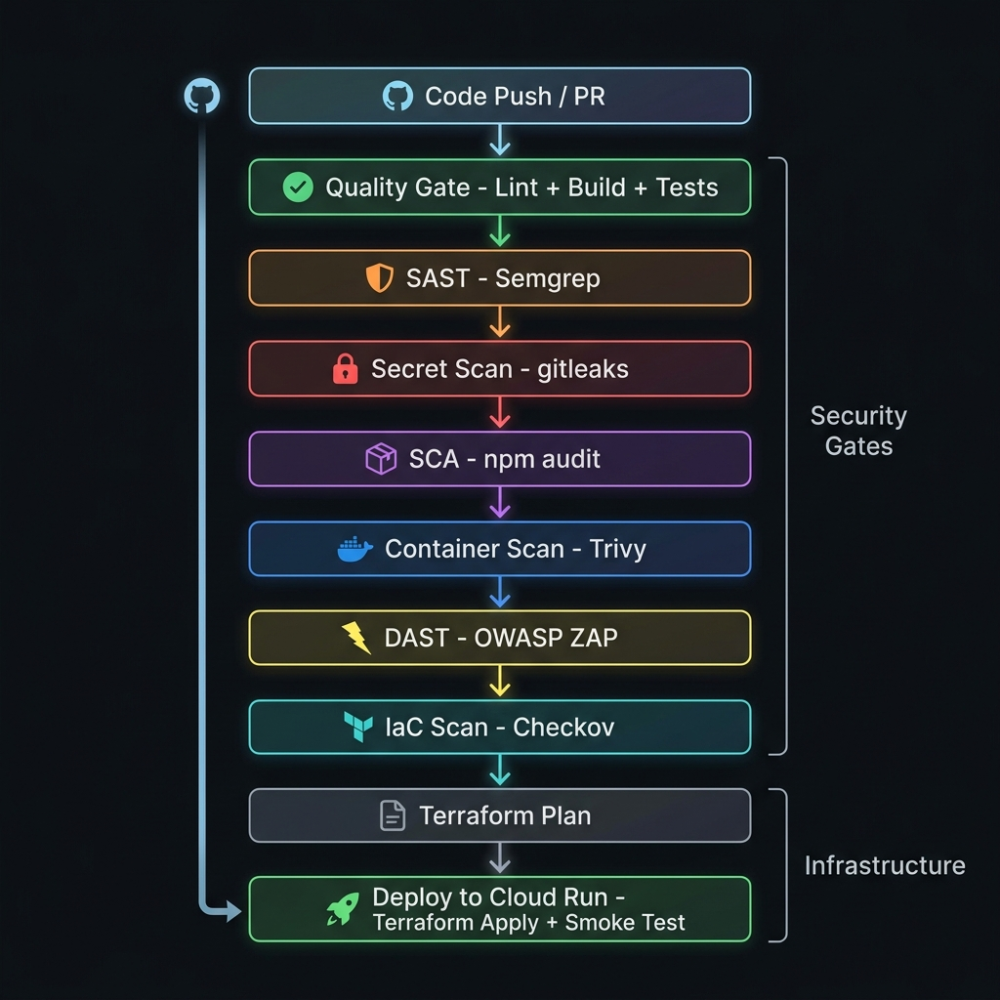

# DevSecOps CI/CD Pipeline — GCP Infrastructure

A production-grade **DevSecOps pipeline** that enforces 9 automated security gates before any code reaches production. Built with Terraform IaC, Docker, and GitHub Actions — deploying a containerized Next.js application to Google Cloud Run.

---

## Pipeline Architecture

<p align="center">
  
</p>

Every push to `main` triggers **9 sequential stages**. Code must pass all security gates before infrastructure is provisioned and the application is deployed.

---

## Security Gates

| # | Stage | Tool | What It Catches | Fails On |
|---|-------|------|----------------|----------|
| 1 | **Quality Gate** | ESLint + Next.js Build | Syntax errors, code smells, broken builds | Any lint or build error |
| 2 | **SAST** | Semgrep | Injection, XSS, insecure code patterns | OWASP Top 10 violations |
| 3 | **Secret Scan** | gitleaks | API keys, tokens, credentials in source | Any secret detected |
| 4 | **SCA** | npm audit | Known CVEs in dependencies | HIGH / CRITICAL vulnerabilities |
| 5 | **Container Scan** | Trivy + custom parser | OS & library CVEs in Docker image | CRITICAL CVEs (custom triage) |
| 6 | **DAST** | OWASP ZAP Baseline | Runtime web vulnerabilities | HIGH findings |
| 7 | **IaC Scan** | Checkov | Terraform misconfigurations | Security policy violations |
| 8 | **Terraform Plan** | Terraform | Infrastructure drift, invalid config | Plan errors |
| 9 | **Deploy** | Docker + Terraform Apply | Deployment failures | Smoke test failure |

---

## Infrastructure (Terraform)

All infrastructure is defined as code in [`terraform/`](./terraform/):

| Resource | Purpose |
|----------|---------|
| **Artifact Registry** | Private Docker image repository (KMS-encrypted, auto-cleanup policy) |
| **Cloud Run** | Serverless container hosting — scales to zero, pay-per-request |
| **Service Accounts** | Least-privilege: `cicd-sa` (deploy only) / `run-sa` (runtime only) |
| **Secret Manager** | Runtime secrets injected at deploy time — never hardcoded |
| **KMS Key Ring** | Customer-managed encryption for container images |
| **IAM Bindings** | Granular role assignments — no over-provisioned access |

### Key Security Decisions

- **Workload Identity Federation (OIDC)** — GitHub Actions authenticates to GCP without any stored JSON keys
- **Secret Manager injection** — API keys are mounted into Cloud Run at deploy time via Terraform
- **Git SHA tagging** — Each deploy is tagged with the commit SHA for full traceability
- **Auto-cleanup policies** — Old container images are automatically purged (keep 10 most recent)
- **Custom Trivy triage** — `scripts/parse_trivy.py` applies project-specific CVE acceptance criteria

---

## Tech Stack

| Layer | Technology |
|-------|-----------|
| Application | Next.js 14, TypeScript, Firebase |
| Containerization | Docker (multi-stage build) |
| Infrastructure | Terraform (GCP provider v5) |
| CI/CD | GitHub Actions (9-stage ordered pipeline) |
| Cloud Platform | Google Cloud Run, Artifact Registry, Secret Manager, KMS |
| Auth (CI/CD) | Workload Identity Federation (OIDC — keyless) |
| Security Tools | Semgrep, gitleaks, Trivy, OWASP ZAP, Checkov |

---

## Quick Start

### Prerequisites
- GCP project with billing enabled
- `gcloud` CLI authenticated
- Terraform ≥ 1.5

### 1. Bootstrap GCP Resources
```bash
bash gcp-bootstrap.sh
```

### 2. Configure GitHub Secrets
Set these in **Settings → Secrets and variables → Actions → Secrets**:

| Secret | Description |
|--------|-------------|
| `GCP_WIF_PROVIDER` | Workload Identity Federation provider path |
| `GCP_WIF_SERVICE_ACCOUNT` | CI/CD service account email |

### 3. Push & Deploy
```bash
git push origin main
```

The pipeline runs all 9 stages automatically. On success, the application is live on Cloud Run.

---

## Project Structure

```
├── .github/workflows/ci.yml    # 9-stage DevSecOps pipeline
├── terraform/
│   ├── main.tf                 # All GCP resources (AR, Cloud Run, IAM, KMS, Secrets)
│   ├── variables.tf            # Input variables with validation
│   └── outputs.tf              # Cloud Run URL, registry path
├── Dockerfile                  # Multi-stage production build
├── gcp-bootstrap.sh            # One-time GCP project setup
├── scripts/
│   ├── parse_trivy.py          # Custom Trivy CVE triage logic
│   └── setup-devsecops.sh      # Local security tool installer
├── firestore.rules             # Firebase security rules
└── apphosting.yaml             # Firebase App Hosting config
```

---

## License

This project is part of a DevSecOps infrastructure portfolio.
